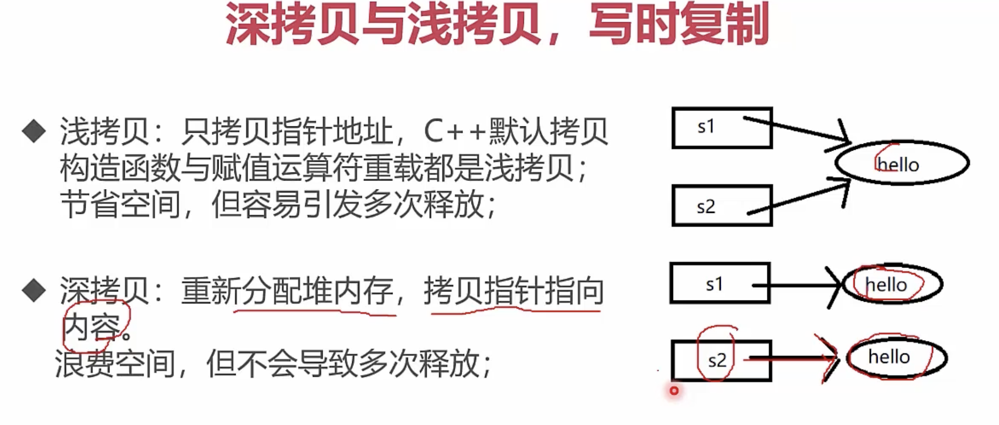

# C++ 复制语义

“默认复制一定是浅拷贝”并不准确。编译器生成的复制操作会逐个复制成员：

- `std::string`、`std::vector` 等值类型复制后相互独立；
- 裸指针成员只复制地址，因此两个对象会指向同一处；
- `std::unique_ptr` 禁止复制；`std::shared_ptr` 复制后共享所有权。

真正的问题不是“深”或“浅”，而是类承诺什么语义。拥有资源的类通常应把资源交给标准库成员管理，从而遵循 Rule of Zero。若必须直接管理资源，则要完整设计析构、复制、移动、自赋值和异常安全。

